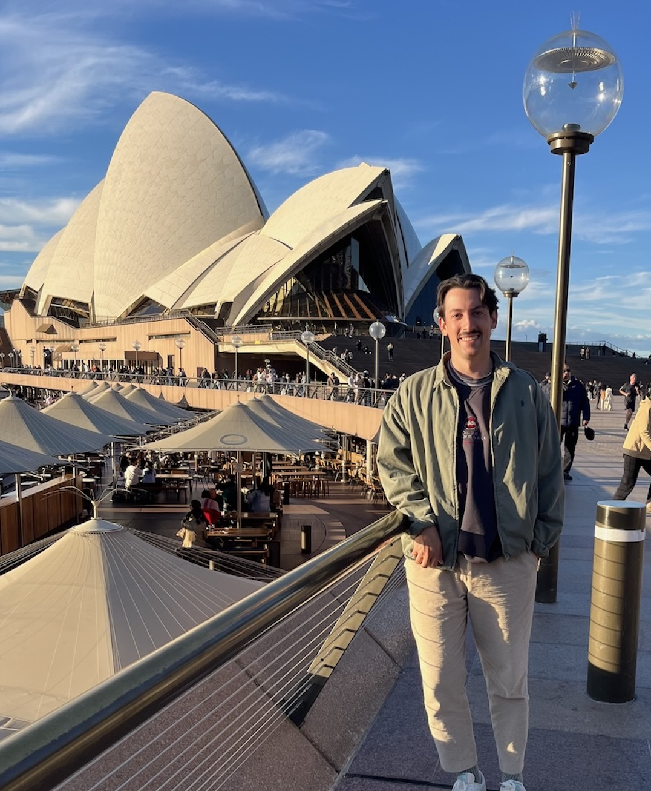

::: {.columns}
::: {.column width="30%"}
{width=210px}
:::

::: {.column width="70%"}
I am a Ph.D. student in the Media, Technology, and Society program at Northwestern University, where my research examines how individuals and teams interact with emerging technologies -- particularly generative AI systems, social media, and search engines -- through the lens of human-computer interaction and social network analysis. 

In my current role as Team Research Lead at the Science of Networks in Communities (SONIC) Lab, I direct an interdisciplinary project -- funded by the U.S. Army Research Laboratory and Microsoft Research -- which investigates how multimodal large language models (MLLMs) function as collaborators in human-AI teams. Using experimental techniques, we analyze how different forms of AI participation -- none vs. unimodal vs. multimodal -- affect team trust, task performance, and overall team viability. The project translates classical team-process theory into measurable constructs that evaluate both taskwork (execution) and teamwork (coordination) behaviors of AI teammates. 

Complementing this line of work, my forthcoming paper in the Journal of Advertising Research, Consumer Engagement with AI-Powered Search Engines and Implications for the Future of Search Advertising, uses survey and behavioral data to analyze how users’ motivations influence their interactions with AI-augmented search platforms. This research builds on earlier work from my master’s thesis at the University of Minnesota, where I examined how individual differences -- such as cognitive motivation and product knowledge -- shape the way consumers construct queries and evaluate information in online environments. Across these studies, I have honed expertise in fieldwork and survey design, psychometric measurement, and advanced statistical modeling using R/SPSS, with applications ranging from ANOVA and regression to factor and network analyses.

Prior to my doctoral and masters studies, I worked as a Market and Consumer Insight Associate Account Executive at Kennedy Communications, where I analyzed paid search, social media, and email marketing data to inform campaign optimization for national clients. Using R-based Shiny dashboards and Google Data Studio, I developed workflows for data ingestion, analysis, and visualization -- experiences that sparked my interest in how data-driven insights can improve both human and organizational performance. This early work in applied analytics continues to guide my research philosophy: that quantitative rigor is most impactful when paired with actionable insights for decision-makers.

Outside of academia, I love being active (hiking and playing sports) and traveling with my friends and family. If you’re interested in collaboration, or have questions about my research, please reach out at the email below!
:::
:::
