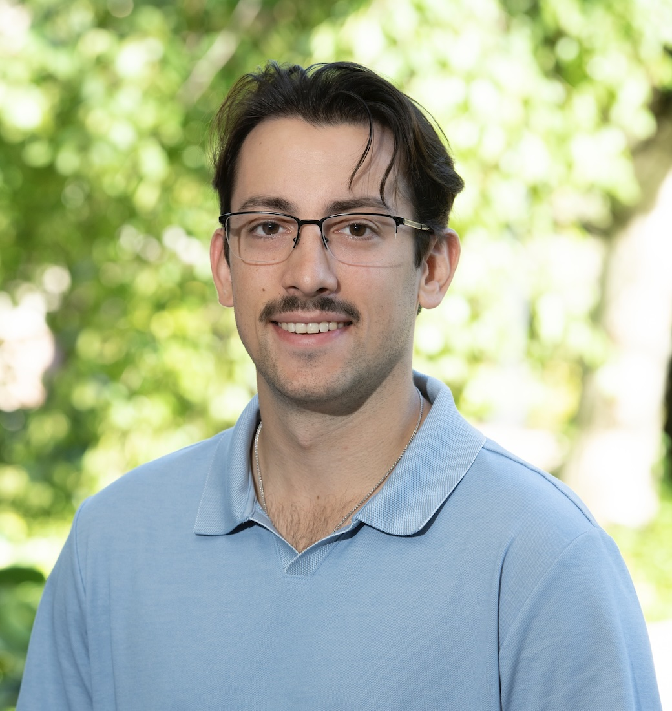

::: {.columns}
::: {.column width="30%"}
{width=210px}
:::

::: {.column width="70%"}
Gabriel Garlough-Shah is a PhD student in the Media, Technology, and Society program working with Dr. Noshir Contractor in the Science of Networks in Communities (SONIC) lab and with Dr. Nathan Walter in the Center Of Media Psychology and Social Influence (COM-PSI). His interests center around addressing questions within the fields of information retrieval, human-computer interaction, social networks, and consumer behavior; specifically, those concerned with individuals’ use of social media, search engines, and generative AI. These questions largely focus on individuals’ ability to obtain and engage with content on these interactive media, along with affective and behavioral reactions toward said content. His current work assess how the performance, communication patterns, and viability of teams may be affected by the introduction of agentic AI-teammates into organizational settings. He holds a B.A. from the University of Wisconsin-Madison (Strategic Communication) and an M.A. from the University of Minnesota-Twin Cities (Mass Communication).
:::
:::